# Lexora Database Schema Draft

## Status

هذه نسخة مبدئية احترافية من مخطط قاعدة البيانات الخاص بنظام Lexora.

النطاق الحالي يغطي كل الجداول المقترحة للمشروع بالكامل، وليس النسخة الأولى فقط. بعض الجداول يمكن تنفيذها لاحقا حسب أولوية التطوير، لكنها موثقة هنا حتى تكون الصورة الكاملة للنظام واضحة من البداية.

## Scope

الجداول الموضحة في هذا الملف حاليا:

- `Persons`
- `Users`
- `Roles`
- `Permissions`
- `UserRoles`
- `RolePermissions`
- `RefreshTokens`
- `Clients`
- `ClientNotes`
- `Cases`
- `CaseNotes`
- `Hearings`
- `Documents`
- `Tasks`
- `Payments`
- `Notifications`
- `AuditLogs`
- `Settings`
- `Tenants`
- `OfficeBranches`
- `Subscriptions`
- `SubscriptionPlans`
- `Invoices`
- `InvoiceItems`
- `Expenses`
- `Appointments`
- `CaseTimelineEvents`
- `DocumentVersions`
- `DocumentOcrJobs`
- `DocumentClassifications`
- `AiConversations`
- `AiMessages`
- `AiSearchQueries`
- `NotificationTemplates`
- `IntegrationProviders`
- `IntegrationCredentials`
- `BackgroundJobs`

## Design Goals

- فصل البيانات الشخصية عن بيانات تسجيل الدخول.
- دعم أكثر من دور للمستخدم الواحد.
- دعم صلاحيات تفصيلية قابلة للاستخدام مع Policy-Based Authorization.
- دعم JWT Authentication و Refresh Tokens.
- دعم إدارة العملاء والقضايا والجلسات والمستندات والمهام والمدفوعات.
- دعم الإشعارات وسجلات التدقيق والإعدادات.
- دعم الفواتير والمصروفات والمواعيد غير القضائية.
- دعم الفروع، الاشتراكات، وتهيئة المشروع لاحقا كنسخة SaaS.
- دعم OCR وتصنيف المستندات والمساعد الذكي والبحث الذكي كخصائص مستقبلية.
- تجهيز التصميم للتوسع بدون تعقيد زائد في النسخة الأولى.
- الحفاظ على قابلية التتبع من خلال حقول مثل `CreatedAt`, `AssignedAt`, `GrantedAt`.

## Legend

| الاختصار | المعنى |
| --- | --- |
| `PK` | Primary Key |
| `FK` | Foreign Key |
| `UQ` | Unique Constraint or Unique Index |
| `NN` | Not Null |
| `NULL` | Nullable |
| `IX` | Index |

## Relationship Map

```mermaid
erDiagram
    PERSONS ||--o| USERS : "has account"

    USERS ||--o{ USERROLES : "has roles"
    USERS ||--o{ USERROLES : "assigns roles"
    ROLES ||--o{ USERROLES : "assigned to users"

    ROLES ||--o{ ROLEPERMISSIONS : "has permissions"
    PERMISSIONS ||--o{ ROLEPERMISSIONS : "granted to roles"
    USERS ||--o{ ROLEPERMISSIONS : "grants permissions"

    USERS ||--o{ REFRESHTOKENS : "owns tokens"
    REFRESHTOKENS ||--o| REFRESHTOKENS : "replaced by"

    CLIENTS ||--o{ CLIENTNOTES : "has notes"
    CLIENTS ||--o{ CASES : "owns cases"
    USERS ||--o{ CASES : "assigned lawyer"
    CASES ||--o| CASES : "appealed / parent case"
    CASES ||--o{ CASENOTES : "has notes"
    CASES ||--o{ HEARINGS : "has hearings"
    CLIENTS ||--o{ DOCUMENTS : "has documents"
    CASES ||--o{ DOCUMENTS : "has documents"
    USERS ||--o{ DOCUMENTS : "uploads"
    USERS ||--o{ TASKS : "assigned tasks"
    CLIENTS ||--o{ TASKS : "related tasks"
    CASES ||--o{ TASKS : "related tasks"
    HEARINGS ||--o{ TASKS : "related tasks"
    DOCUMENTS ||--o{ TASKS : "related tasks"
    CLIENTS ||--o{ PAYMENTS : "has payments"
    CASES ||--o{ PAYMENTS : "has payments"
    USERS ||--o{ NOTIFICATIONS : "receives"
    USERS ||--o{ AUDITLOGS : "performs actions"

    TENANTS ||--o{ OFFICEBRANCHES : "has branches"
    TENANTS ||--o{ SUBSCRIPTIONS : "has subscriptions"
    SUBSCRIPTIONPLANS ||--o{ SUBSCRIPTIONS : "selected plan"
    TENANTS ||--o{ INVOICES : "billed"
    CLIENTS ||--o{ INVOICES : "has invoices"
    CASES ||--o{ INVOICES : "case invoices"
    INVOICES ||--o{ INVOICEITEMS : "has items"
    CLIENTS ||--o{ EXPENSES : "related expenses"
    CASES ||--o{ EXPENSES : "case expenses"
    OFFICEBRANCHES ||--o{ EXPENSES : "branch expenses"
    DOCUMENTS ||--o{ EXPENSES : "receipt document"
    CLIENTS ||--o{ APPOINTMENTS : "has appointments"
    CASES ||--o{ APPOINTMENTS : "case appointments"
    USERS ||--o{ APPOINTMENTS : "assigned appointments"
    CASES ||--o{ CASETIMELINEEVENTS : "timeline"
    DOCUMENTS ||--o{ DOCUMENTVERSIONS : "has versions"
    DOCUMENTS ||--o{ DOCUMENTOCRJOBS : "ocr jobs"
    DOCUMENTS ||--o{ DOCUMENTCLASSIFICATIONS : "classifications"
    USERS ||--o{ AICONVERSATIONS : "starts ai conversations"
    CLIENTS ||--o{ AICONVERSATIONS : "client context"
    CASES ||--o{ AICONVERSATIONS : "case context"
    DOCUMENTS ||--o{ AICONVERSATIONS : "document context"
    AICONVERSATIONS ||--o{ AIMESSAGES : "has messages"
    USERS ||--o{ AISEARCHQUERIES : "runs searches"
    CLIENTS ||--o{ AISEARCHQUERIES : "client search scope"
    CASES ||--o{ AISEARCHQUERIES : "case search scope"
    INTEGRATIONPROVIDERS ||--o{ INTEGRATIONCREDENTIALS : "has credentials"
    TENANTS ||--o{ INTEGRATIONCREDENTIALS : "tenant credentials"
```

## Relationship Summary

| From | To | Type | Description |
| --- | --- | --- | --- |
| `Persons` | `Users` | 1 : 0..1 | كل شخص يمكن أن يكون له حساب مستخدم واحد اختياري داخل النظام. |
| `Users` | `UserRoles` | 1 : Many | المستخدم يمكن أن يمتلك أكثر من دور. |
| `Roles` | `UserRoles` | 1 : Many | الدور يمكن إسناده لأكثر من مستخدم. |
| `Users` | `UserRoles.AssignedByUserId` | 1 : Many | مستخدم يمكنه إسناد أدوار لمستخدمين آخرين. |
| `Roles` | `RolePermissions` | 1 : Many | الدور يمكن ربطه بعدة صلاحيات. |
| `Permissions` | `RolePermissions` | 1 : Many | الصلاحية يمكن ربطها بعدة أدوار. |
| `Users` | `RolePermissions.GrantedByUserId` | 1 : Many | مستخدم يمكنه منح صلاحيات لأدوار. |
| `Users` | `RefreshTokens` | 1 : Many | المستخدم يمكن أن يمتلك عدة Refresh Tokens بسبب تعدد الجلسات أو الأجهزة. |
| `RefreshTokens` | `RefreshTokens.ReplacedByTokenId` | 1 : 0..1 | التوكن يمكن استبداله بتوكن جديد عند التدوير لمنع إعادة الاستخدام. |
| `Clients` | `Cases` | 1 : Many | العميل يمكن أن يمتلك عدة قضايا. |
| `Clients` | `ClientNotes` | 1 : Many | العميل يمكن أن يمتلك عدة ملاحظات. |
| `Cases` | `CaseNotes` | 1 : Many | القضية يمكن أن تحتوي على عدة ملاحظات. |
| `Cases` | `Hearings` | 1 : Many | القضية يمكن أن تحتوي على عدة جلسات. |
| `Clients` | `Documents` | 1 : Many | المستند يمكن ربطه بعميل. |
| `Cases` | `Documents` | 1 : Many | المستند يمكن ربطه بقضية. |
| `Users` | `Documents.UploadedByUserId` | 1 : Many | المستخدم يمكنه رفع عدة مستندات. |
| `Users` | `Tasks.AssignedToUserId` | 1 : Many | المستخدم يمكن إسناد عدة مهام إليه. |
| `Clients` | `Tasks` | 1 : Many | المهمة يمكن ربطها بعميل. |
| `Cases` | `Tasks` | 1 : Many | المهمة يمكن ربطها بقضية. |
| `Hearings` | `Tasks` | 1 : Many | المهمة يمكن ربطها بجلسة. |
| `Documents` | `Tasks` | 1 : Many | المهمة يمكن ربطها بمستند. |
| `Clients` | `Payments` | 1 : Many | العميل يمكن أن يمتلك عدة مدفوعات. |
| `Cases` | `Payments` | 1 : Many | الدفع يمكن ربطه بقضية اختياريا. |
| `Users` | `Notifications` | 1 : Many | المستخدم يمكن أن يستقبل عدة إشعارات. |
| `Users` | `AuditLogs` | 1 : Many | المستخدم يمكن أن ينشئ عدة سجلات تدقيق. |
| `Tenants` | `OfficeBranches` | 1 : Many | المكتب أو المؤسسة يمكن أن تمتلك عدة فروع. |
| `Tenants` | `Subscriptions` | 1 : Many | المكتب يمكن أن يمتلك سجل اشتراكات. |
| `SubscriptionPlans` | `Subscriptions` | 1 : Many | خطة الاشتراك يمكن استخدامها في عدة اشتراكات. |
| `Tenants` | `Invoices` | 1 : Many | الفواتير يمكن أن ترتبط بمكتب في وضع SaaS. |
| `Clients` | `Invoices` | 1 : Many | العميل يمكن أن يمتلك عدة فواتير. |
| `Cases` | `Invoices` | 1 : Many | القضية يمكن أن تمتلك فواتير مرتبطة بها. |
| `Invoices` | `InvoiceItems` | 1 : Many | الفاتورة تحتوي على عدة بنود. |
| `Clients` | `Expenses` | 1 : Many | المصروف يمكن ربطه بعميل. |
| `Cases` | `Expenses` | 1 : Many | المصروف يمكن ربطه بقضية. |
| `OfficeBranches` | `Expenses` | 1 : Many | المصروف يمكن ربطه بفرع. |
| `Documents` | `Expenses.ReceiptDocumentId` | 1 : Many | يمكن استخدام مستند كإيصال لمصروف. |
| `Clients` | `Appointments` | 1 : Many | الموعد يمكن ربطه بعميل. |
| `Cases` | `Appointments` | 1 : Many | الموعد يمكن ربطه بقضية. |
| `Users` | `Appointments.AssignedToUserId` | 1 : Many | الموعد يمكن إسناده لمستخدم. |
| `Cases` | `CaseTimelineEvents` | 1 : Many | القضية يمكن أن تحتوي على خط زمني من الأحداث. |
| `Documents` | `DocumentVersions` | 1 : Many | المستند يمكن أن يحتوي على عدة نسخ. |
| `Documents` | `DocumentOcrJobs` | 1 : Many | المستند يمكن أن يخضع لعدة عمليات OCR. |
| `Documents` | `DocumentClassifications` | 1 : Many | المستند يمكن أن يمتلك عدة نتائج تصنيف. |
| `Users` | `AiConversations` | 1 : Many | المستخدم يمكن أن يبدأ عدة محادثات AI. |
| `AiConversations` | `AiMessages` | 1 : Many | محادثة AI تحتوي على عدة رسائل. |
| `Users` | `AiSearchQueries` | 1 : Many | المستخدم يمكن أن ينفذ عدة عمليات بحث ذكي. |
| `IntegrationProviders` | `IntegrationCredentials` | 1 : Many | مزود التكامل يمكن أن يمتلك عدة بيانات ربط. |
| `Tenants` | `IntegrationCredentials` | 1 : Many | بيانات الربط يمكن تخصيصها لكل مكتب في وضع SaaS. |

---

## Table: `Persons`

الغرض: تخزين البيانات الشخصية الأساسية بشكل منفصل عن بيانات الدخول.

هذا الفصل يجعل النظام أكثر مرونة، لأن الشخص قد يكون مستخدما داخل النظام الآن، وقد يتم ربطه لاحقا بكيانات أخرى مثل موظف أو محام أو جهة داخلية بدون خلط ذلك ببيانات تسجيل الدخول.

| Column | Data Type | Constraints | Arabic Meaning |
| --- | --- | --- | --- |
| `Id` | `INT` | `PK`, `IDENTITY`, `NN` | المعرف |
| `FullName` | `NVARCHAR(200)` | `NN` | الاسم الكامل |
| `PhoneNumber` | `NVARCHAR(20)` | `NULL`, `IX` | رقم الهاتف |
| `Address` | `NVARCHAR(250)` | `NULL` | العنوان |
| `CreatedAt` | `DATETIME2` | `NN`, `DEFAULT SYSUTCDATETIME()` | تاريخ الإنشاء |
| `UpdatedAt` | `DATETIME2` | `NULL` | تاريخ آخر تعديل |

ملاحظات:

- لا يفضل جعل `PhoneNumber` فريدا في النسخة الأولى لأن أكثر من شخص قد يستخدم نفس رقم المكتب أو رقم عائلي.
- يمكن إضافة `NationalId` لاحقا عند الحاجة، خصوصا لو تم استخدام `Persons` لتمثيل موظفين أو محامين بشكل أوسع.
- لا يتم وضع بيانات تسجيل الدخول هنا. بيانات الدخول مكانها جدول `Users`.

---

## Table: `Users`

الغرض: تخزين حسابات المستخدمين الذين يمكنهم تسجيل الدخول إلى النظام.

| Column | Data Type | Constraints | Arabic Meaning |
| --- | --- | --- | --- |
| `Id` | `INT` | `PK`, `IDENTITY`, `NN` | المعرف |
| `PersonId` | `INT` | `FK`, `NN`, `UQ` | معرف الشخص |
| `Username` | `NVARCHAR(50)` | `NN`, `UQ` | اسم المستخدم |
| `Email` | `NVARCHAR(150)` | `NN`, `UQ` | البريد الإلكتروني |
| `PasswordHash` | `NVARCHAR(500)` | `NN` | كلمة المرور بعد التشفير |
| `IsActive` | `BIT` | `NN`, `DEFAULT 1` | هل الحساب مفعل |
| `IsLocked` | `BIT` | `NN`, `DEFAULT 0` | هل الحساب مقفل |
| `FailedLoginAttempts` | `INT` | `NN`, `DEFAULT 0` | عدد محاولات تسجيل الدخول الفاشلة |
| `LockedUntil` | `DATETIME2` | `NULL` | تاريخ انتهاء قفل الحساب |
| `LastLoginAt` | `DATETIME2` | `NULL` | آخر تسجيل دخول ناجح |
| `PasswordChangedAt` | `DATETIME2` | `NULL` | تاريخ آخر تغيير لكلمة المرور |
| `CreatedAt` | `DATETIME2` | `NN`, `DEFAULT SYSUTCDATETIME()` | تاريخ الإنشاء |
| `CreatedByUserId` | `INT` | `FK`, `NULL` | المستخدم الذي أنشأ الحساب |
| `UpdatedAt` | `DATETIME2` | `NULL` | تاريخ آخر تعديل |
| `UpdatedByUserId` | `INT` | `FK`, `NULL` | المستخدم الذي عدل الحساب |

ملاحظات:

- `PersonId` فريد لضمان أن الشخص الواحد لا يمتلك أكثر من حساب مستخدم واحد.
- `Email` موجود داخل `Users` لأنه مرتبط بعمليات تسجيل الدخول واسترجاع كلمة المرور.
- لا يتم تخزين كلمة المرور كنص خام. يتم تخزين `PasswordHash` فقط.
- `IsLocked`, `FailedLoginAttempts`, و `LockedUntil` تدعم Account Locking.
- يفضل استخدام `SYSUTCDATETIME()` لتوحيد توقيتات النظام.

قواعد مقترحة:

- لا يسمح بتسجيل الدخول إذا كان `IsActive = 0`.
- لا يسمح بتسجيل الدخول إذا كان `IsLocked = 1` وما زال `LockedUntil` في المستقبل.
- عند نجاح تسجيل الدخول يتم تحديث `LastLoginAt` وتصفير `FailedLoginAttempts`.
- عند فشل تسجيل الدخول يتم زيادة `FailedLoginAttempts` وقد يتم تحديث `IsLocked` و `LockedUntil` حسب السياسة.

---

## Table: `Roles`

الغرض: تخزين الأدوار الأساسية داخل النظام.

أمثلة: `Admin`, `Lawyer`, `Secretary`, `Accountant`.

| Column | Data Type | Constraints | Arabic Meaning |
| --- | --- | --- | --- |
| `Id` | `INT` | `PK`, `IDENTITY`, `NN` | المعرف |
| `RoleName` | `NVARCHAR(100)` | `NN`, `UQ` | اسم الدور |
| `Description` | `NVARCHAR(255)` | `NULL` | وصف الدور |
| `IsSystemRole` | `BIT` | `NN`, `DEFAULT 0` | هل هذا دور نظام ثابت |
| `CreatedAt` | `DATETIME2` | `NN`, `DEFAULT SYSUTCDATETIME()` | تاريخ الإنشاء |
| `UpdatedAt` | `DATETIME2` | `NULL` | تاريخ آخر تعديل |

ملاحظات:

- `RoleName` يجب أن يكون فريدا حتى لا تتكرر الأدوار.
- `IsSystemRole = 1` يستخدم للأدوار الأساسية التي لا يفضل حذفها أو تغيير اسمها.
- يمكن لاحقا إضافة `IsActive` إذا احتجنا تعطيل دور بدون حذفه.

---

## Table: `Permissions`

الغرض: تخزين الصلاحيات التفصيلية التي يستخدمها النظام للتحكم في الوصول.

| Column | Data Type | Constraints | Arabic Meaning |
| --- | --- | --- | --- |
| `Id` | `INT` | `PK`, `IDENTITY`, `NN` | المعرف |
| `PermissionCode` | `NVARCHAR(100)` | `NN`, `UQ` | كود الصلاحية |
| `PermissionName` | `NVARCHAR(100)` | `NN` | اسم الصلاحية |
| `Description` | `NVARCHAR(255)` | `NULL` | وصف الصلاحية |
| `ModuleName` | `NVARCHAR(100)` | `NN` | اسم الموديول أو القسم |
| `CreatedAt` | `DATETIME2` | `NN`, `DEFAULT SYSUTCDATETIME()` | تاريخ الإنشاء |
| `UpdatedAt` | `DATETIME2` | `NULL` | تاريخ آخر تعديل |

ملاحظات:

- `PermissionCode` يجب أن يكون ثابتا وواضحا مثل `users.view`, `cases.edit`, `payments.create`.
- الكود هو المرجع الأفضل داخل التطبيق، وليس اسم الصلاحية المعروض.
- `ModuleName` يساعد في تجميع الصلاحيات داخل شاشة الإدارة.

---

## Table: `UserRoles`

الغرض: ربط المستخدمين بالأدوار في علاقة many-to-many.

هذا التصميم يسمح للمستخدم الواحد أن يمتلك أكثر من دور عند الحاجة، مثل مستخدم يكون `Lawyer` و `Admin` في نفس الوقت.

| Column | Data Type | Constraints | Arabic Meaning |
| --- | --- | --- | --- |
| `UserId` | `INT` | `PK`, `FK`, `NN` | معرف المستخدم |
| `RoleId` | `INT` | `PK`, `FK`, `NN` | معرف الدور |
| `AssignedAt` | `DATETIME2` | `NN`, `DEFAULT SYSUTCDATETIME()` | تاريخ إسناد الدور |
| `AssignedByUserId` | `INT` | `FK`, `NULL` | المستخدم الذي أسند الدور |

ملاحظات:

- المفتاح الأساسي مركب من `UserId` و `RoleId`.
- هذا يمنع تكرار نفس الدور لنفس المستخدم أكثر من مرة.
- عند الحاجة لتتبع تاريخ كامل لتغييرات الأدوار، يتم الاعتماد على `AuditLogs` لاحقا.

---

## Table: `RolePermissions`

الغرض: ربط الأدوار بالصلاحيات في علاقة many-to-many.

| Column | Data Type | Constraints | Arabic Meaning |
| --- | --- | --- | --- |
| `RoleId` | `INT` | `PK`, `FK`, `NN` | معرف الدور |
| `PermissionId` | `INT` | `PK`, `FK`, `NN` | معرف الصلاحية |
| `GrantedAt` | `DATETIME2` | `NN`, `DEFAULT SYSUTCDATETIME()` | تاريخ منح الصلاحية |
| `GrantedByUserId` | `INT` | `FK`, `NULL` | المستخدم الذي منح الصلاحية |

ملاحظات:

- المفتاح الأساسي مركب من `RoleId` و `PermissionId`.
- هذا يمنع تكرار نفس الصلاحية لنفس الدور أكثر من مرة.
- حذف صلاحية من دور يجب أن يسجل لاحقا في `AuditLogs` لأنه تغيير حساس.

---

## Table: `RefreshTokens`

الغرض: تخزين Refresh Tokens الخاصة بـ JWT Authentication بشكل آمن وقابل للإلغاء.

| Column | Data Type | Constraints | Arabic Meaning |
| --- | --- | --- | --- |
| `Id` | `INT` | `PK`, `IDENTITY`, `NN` | المعرف |
| `UserId` | `INT` | `FK`, `NN`, `IX` | معرف المستخدم |
| `FamilyId` | `NVARCHAR(100)` | `NN`, `IX` | معرف سلسلة التوكنات لمنع الاختراق |
| `TokenHash` | `NVARCHAR(500)` | `NN`, `UQ` | قيمة التوكن بعد التشفير أو الهاش |
| `ExpiresAt` | `DATETIME2` | `NN` | تاريخ انتهاء الصلاحية |
| `CreatedAt` | `DATETIME2` | `NN`, `DEFAULT SYSUTCDATETIME()` | تاريخ الإنشاء |
| `CreatedByIp` | `NVARCHAR(45)` | `NULL` | عنوان IP عند الإنشاء |
| `RevokedAt` | `DATETIME2` | `NULL` | تاريخ الإلغاء |
| `RevokedByIp` | `NVARCHAR(45)` | `NULL` | عنوان IP عند الإلغاء |
| `ReplacedByTokenId` | `INT` | `FK`, `NULL` | التوكن البديل عند التجديد |
| `RevokeReason` | `NVARCHAR(255)` | `NULL` | سبب الإلغاء |

ملاحظات:

- لا يفضل تخزين Refresh Token كنص خام. الأفضل تخزين `TokenHash`.
- `TokenHash` يجب أن يكون فريدا.
- `ReplacedByTokenId` يستخدم عند تدوير التوكنات Token Rotation.
- التوكن يعتبر غير صالح إذا كان `RevokedAt` ليس فارغا أو `ExpiresAt` في الماضي.
- الحقل `FamilyId` يمثل معرف عائلة التوكن، وعند اكتشاف محاولة إعادة استخدام توكن قديم يتم إلغاء جميع التوكنات التي تشترك في نفس `FamilyId` فوراً.

قواعد مقترحة:

- كل تسجيل دخول ناجح يمكن أن ينشئ Refresh Token جديد مع توليد `FamilyId` جديد.
- عند تسجيل الخروج يتم تحديث `RevokedAt`.
- عند تجديد التوكن يتم إلغاء التوكن القديم وربطه بالتوكن الجديد عبر `ReplacedByTokenId` مع توريث نفس قيمة الـ `FamilyId`.
- عند اكتشاف محاولة استخدام توكن قديم مستبدل مسبقاً، يتم إلغاء كافة التوكنات المرتبطة بنفس الـ `FamilyId` لمنع هجمات التكرار (Replay Attacks).
- عند تعطيل مستخدم يجب إلغاء جميع Refresh Tokens الخاصة به.

---

## Table: `Clients`

الغرض: تخزين بيانات العملاء الذين يتعامل معهم مكتب المحاماة.

العميل قد يكون شخصا أو شركة أو جهة، وله قضايا ومدفوعات ومستندات وملاحظات.

| Column | Data Type | Constraints | Arabic Meaning |
| --- | --- | --- | --- |
| `Id` | `INT` | `PK`, `IDENTITY`, `NN` | المعرف |
| `ClientType` | `NVARCHAR(50)` | `NN`, `DEFAULT 'Individual'` | نوع العميل |
| `FullName` | `NVARCHAR(200)` | `NN`, `IX` | الاسم الكامل أو اسم الجهة |
| `NationalId` | `NVARCHAR(50)` | `NULL`, `IX` | الرقم القومي أو رقم التسجيل |
| `PhoneNumber` | `NVARCHAR(20)` | `NULL`, `IX` | رقم الهاتف |
| `Email` | `NVARCHAR(150)` | `NULL` | البريد الإلكتروني |
| `Address` | `NVARCHAR(250)` | `NULL` | العنوان |
| `Notes` | `NVARCHAR(MAX)` | `NULL` | ملاحظات عامة |
| `Status` | `NVARCHAR(50)` | `NN`, `DEFAULT 'Active'` | حالة العميل |
| `IsDeleted` | `BIT` | `NN`, `DEFAULT 0` | حذف منطقي |
| `CreatedAt` | `DATETIME2` | `NN`, `DEFAULT SYSUTCDATETIME()` | تاريخ الإنشاء |
| `CreatedByUserId` | `INT` | `FK`, `NULL` | المستخدم الذي أنشأ العميل |
| `UpdatedAt` | `DATETIME2` | `NULL` | تاريخ آخر تعديل |
| `UpdatedByUserId` | `INT` | `FK`, `NULL` | المستخدم الذي عدل العميل |
| `DeletedAt` | `DATETIME2` | `NULL` | تاريخ الحذف المنطقي |
| `DeletedByUserId` | `INT` | `FK`, `NULL` | المستخدم الذي حذف العميل منطقيا |

قيم مقترحة لـ `ClientType`:

- `Individual`
- `Company`
- `Organization`

قيم مقترحة لـ `Status`:

- `Active`
- `Inactive`
- `Archived`

قواعد مقترحة:

- `FullName` مطلوب.
- لا يتم حذف عميل نهائيا إذا كان لديه قضايا أو مدفوعات.
- `NationalId` يمكن جعله فريدا لاحقا إذا تأكدنا من طريقة استخدامه داخل المكتب.
- البحث الأساسي يكون بالاسم، الرقم القومي، ورقم الهاتف.

---

## Table: `ClientNotes`

الغرض: تخزين ملاحظات تفصيلية مرتبطة بالعميل.

| Column | Data Type | Constraints | Arabic Meaning |
| --- | --- | --- | --- |
| `Id` | `INT` | `PK`, `IDENTITY`, `NN` | المعرف |
| `ClientId` | `INT` | `FK`, `NN`, `IX` | معرف العميل |
| `Note` | `NVARCHAR(MAX)` | `NN` | نص الملاحظة |
| `CreatedAt` | `DATETIME2` | `NN`, `DEFAULT SYSUTCDATETIME()` | تاريخ الإنشاء |
| `CreatedByUserId` | `INT` | `FK`, `NULL` | المستخدم الذي كتب الملاحظة |
| `UpdatedAt` | `DATETIME2` | `NULL` | تاريخ آخر تعديل |
| `UpdatedByUserId` | `INT` | `FK`, `NULL` | المستخدم الذي عدل الملاحظة |

قواعد مقترحة:

- الملاحظة يجب أن تنتمي إلى عميل واحد.
- لا تستخدم هذا الجدول لملاحظات القضايا. ملاحظات القضايا مكانها `CaseNotes`.

---

## Table: `Cases`

الغرض: تخزين القضايا أو الملفات القانونية الخاصة بالعملاء.

القضية هي محور النظام، وترتبط بالجلسات والمستندات والمهام والمدفوعات والملاحظات.

| Column | Data Type | Constraints | Arabic Meaning |
| --- | --- | --- | --- |
| `Id` | `INT` | `PK`, `IDENTITY`, `NN` | المعرف |
| `ClientId` | `INT` | `FK`, `NN`, `IX` | معرف العميل |
| `ParentCaseId` | `INT` | `FK`, `NULL`, `IX` | معرف القضية الأب (الدرجة السابقة) |
| `AssignedLawyerId` | `INT` | `FK`, `NULL`, `IX` | المحامي المسؤول |
| `CaseNumber` | `NVARCHAR(100)` | `NULL`, `IX` | رقم القضية |
| `CaseYear` | `INT` | `NULL`, `IX` | سنة القضية الرسمية |
| `CaseType` | `NVARCHAR(100)` | `NULL`, `IX` | نوع القضية (مدني، جنائي، أسرة...) |
| `CourtName` | `NVARCHAR(200)` | `NULL`, `IX` | اسم المحكمة |
| `CourtCircuit` | `NVARCHAR(100)` | `NULL` | الدائرة أو القسم |
| `ClientRole` | `NVARCHAR(50)` | `NN`, `DEFAULT 'Plaintiff'` | صفة عميلنا (Plaintiff مدعي / Defendant مدعى عليه) |
| `OpponentName` | `NVARCHAR(200)` | `NULL` | اسم الخصم |
| `OpponentLawyer` | `NVARCHAR(200)` | `NULL` | محامي الخصم |
| `Status` | `NVARCHAR(50)` | `NN`, `DEFAULT 'Open'`, `IX` | حالة القضية |
| `StartDate` | `DATE` | `NULL` | تاريخ البداية |
| `EndDate` | `DATE` | `NULL` | تاريخ النهاية |
| `Subject` | `NVARCHAR(MAX)` | `NULL` | موضوع الدعوى ومطالبها بالتفصيل |
| `IsArchived` | `BIT` | `NN`, `DEFAULT 0` | هل القضية مؤرشفة |
| `CreatedAt` | `DATETIME2` | `NN`, `DEFAULT SYSUTCDATETIME()` | تاريخ الإنشاء |
| `CreatedByUserId` | `INT` | `FK`, `NULL` | المستخدم الذي أنشأ القضية |
| `UpdatedAt` | `DATETIME2` | `NULL` | تاريخ آخر تعديل |
| `UpdatedByUserId` | `INT` | `FK`, `NULL` | المستخدم الذي عدل القضية |
| `ArchivedAt` | `DATETIME2` | `NULL` | تاريخ الأرشفة |
| `ArchivedByUserId` | `INT` | `FK`, `NULL` | المستخدم الذي أرشف القضية |

قيم مقترحة لـ `Status`:

- `Open`
- `Pending`
- `Scheduled`
- `Closed`
- `Archived`

قواعد عمل هامة ومقترحة:

- القضية يجب أن تنتمي إلى عميل واحد.
- `CaseNumber` و `CaseYear` يمثلان معاً الهوية الرسمية للقضية في المحكمة (مثال: قضية 1500 لسنة 2026).
- يدعم النظام تتبع درجات التقاضي (ابتدائي، استئناف، نقض) بربط القضية الجديدة بالسابقة عبر `ParentCaseId` (ربط شجرة النزاع).
- يحدد حقل `ClientRole` دور العميل كمدعي (Plaintiff) أو مدعى عليه (Defendant) لمساعدة المحامي في تحديد الموقف القانوني فوراً.
- القضية المغلقة لا تقبل جلسات جديدة إلا بعد إعادة فتحها.
- القضية المؤرشفة تكون للقراءة فقط إلا للمدير.
- يتم عمل فحص تعارض المصالح (Conflict of Interest Check) قبل فتح القضية للتأكد من أن الخصم المقترح ليس عميلاً حالياً للمكتب.

---

## Table: `CaseNotes`

الغرض: تخزين الملاحظات المرتبطة بالقضايا.

| Column | Data Type | Constraints | Arabic Meaning |
| --- | --- | --- | --- |
| `Id` | `INT` | `PK`, `IDENTITY`, `NN` | المعرف |
| `CaseId` | `INT` | `FK`, `NN`, `IX` | معرف القضية |
| `Note` | `NVARCHAR(MAX)` | `NN` | نص الملاحظة |
| `CreatedAt` | `DATETIME2` | `NN`, `DEFAULT SYSUTCDATETIME()` | تاريخ الإنشاء |
| `CreatedByUserId` | `INT` | `FK`, `NULL` | المستخدم الذي كتب الملاحظة |
| `UpdatedAt` | `DATETIME2` | `NULL` | تاريخ آخر تعديل |
| `UpdatedByUserId` | `INT` | `FK`, `NULL` | المستخدم الذي عدل الملاحظة |

قواعد مقترحة:

- الملاحظة يجب أن تنتمي إلى قضية واحدة.
- الملاحظات القانونية الحساسة يجب أن تخضع للصلاحيات.

---

## Table: `Hearings`

الغرض: تخزين جلسات المحكمة أو المواعيد القانونية المرتبطة بالقضايا.

| Column | Data Type | Constraints | Arabic Meaning |
| --- | --- | --- | --- |
| `Id` | `INT` | `PK`, `IDENTITY`, `NN` | المعرف |
| `CaseId` | `INT` | `FK`, `NN`, `IX` | معرف القضية |
| `HearingDate` | `DATE` | `NN`, `IX` | تاريخ الجلسة |
| `HearingTime` | `TIME` | `NULL` | وقت الجلسة |
| `CourtName` | `NVARCHAR(200)` | `NULL` | اسم المحكمة |
| `CourtRoom` | `NVARCHAR(100)` | `NULL` | القاعة أو الدائرة |
| `JudgeName` | `NVARCHAR(200)` | `NULL` | اسم القاضي |
| `Notes` | `NVARCHAR(MAX)` | `NULL` | ملاحظات |
| `Result` | `NVARCHAR(MAX)` | `NULL` | نتيجة الجلسة |
| `Status` | `NVARCHAR(50)` | `NN`, `DEFAULT 'Scheduled'`, `IX` | حالة الجلسة |
| `CreatedAt` | `DATETIME2` | `NN`, `DEFAULT SYSUTCDATETIME()` | تاريخ الإنشاء |
| `CreatedByUserId` | `INT` | `FK`, `NULL` | المستخدم الذي أنشأ الجلسة |
| `UpdatedAt` | `DATETIME2` | `NULL` | تاريخ آخر تعديل |
| `UpdatedByUserId` | `INT` | `FK`, `NULL` | المستخدم الذي عدل الجلسة |

قيم مقترحة لـ `Status`:

- `Scheduled`
- `Completed`
- `Postponed`
- `Cancelled`

قواعد مقترحة:

- الجلسة يجب أن تنتمي إلى قضية واحدة.
- `HearingDate` مطلوب.
- الجلسة المكتملة يجب أن تحتوي على `Result` أو `Notes`.
- الجلسات القادمة يجب أن تظهر في لوحة التحكم والإشعارات.

---

## Table: `Documents`

الغرض: تخزين بيانات المستندات القانونية وملفاتها الوصفية.

النظام يخزن بيانات الملف في قاعدة البيانات، أما الملف نفسه فيحفظ على File System أو Object Storage.

| Column | Data Type | Constraints | Arabic Meaning |
| --- | --- | --- | --- |
| `Id` | `INT` | `PK`, `IDENTITY`, `NN` | المعرف |
| `ClientId` | `INT` | `FK`, `NULL`, `IX` | معرف العميل |
| `CaseId` | `INT` | `FK`, `NULL`, `IX` | معرف القضية |
| `DocumentType` | `NVARCHAR(100)` | `NN`, `IX` | نوع المستند |
| `Title` | `NVARCHAR(200)` | `NN`, `IX` | عنوان المستند |
| `FileName` | `NVARCHAR(255)` | `NN` | اسم الملف المخزن |
| `OriginalFileName` | `NVARCHAR(255)` | `NN` | اسم الملف الأصلي |
| `FileExtension` | `NVARCHAR(20)` | `NN` | امتداد الملف |
| `ContentType` | `NVARCHAR(100)` | `NN` | نوع المحتوى |
| `FileSize` | `BIGINT` | `NN` | حجم الملف بالبايت |
| `StoragePath` | `NVARCHAR(500)` | `NN` | مسار التخزين |
| `Description` | `NVARCHAR(500)` | `NULL` | وصف مختصر |
| `IsArchived` | `BIT` | `NN`, `DEFAULT 0` | هل المستند مؤرشف |
| `UploadedAt` | `DATETIME2` | `NN`, `DEFAULT SYSUTCDATETIME()` | تاريخ الرفع |
| `UploadedByUserId` | `INT` | `FK`, `NULL` | المستخدم الذي رفع الملف |
| `ArchivedAt` | `DATETIME2` | `NULL` | تاريخ الأرشفة |
| `ArchivedByUserId` | `INT` | `FK`, `NULL` | المستخدم الذي أرشف الملف |

قيم مقترحة لـ `DocumentType`:

- `Contract`
- `PowerOfAttorney`
- `LegalMemo`
- `CourtDocument`
- `Judgment`
- `Attachment`

قواعد مقترحة:

- يجب أن يرتبط المستند بعميل أو قضية أو الاثنين.
- لا يتم حذف المستند فعليا بشكل افتراضي، بل تتم أرشفته.
- يجب التحقق من نوع الملف وحجمه قبل التخزين.
- إذا تم دعم النسخ لاحقا، يضاف جدول `DocumentVersions`.

---

## Table: `Tasks`

الغرض: تخزين المهام الداخلية المرتبطة بعمل المكتب.

المهمة يمكن أن ترتبط بعميل أو قضية أو جلسة أو مستند، ويجب أن تسند إلى مستخدم مسؤول.

| Column | Data Type | Constraints | Arabic Meaning |
| --- | --- | --- | --- |
| `Id` | `INT` | `PK`, `IDENTITY`, `NN` | المعرف |
| `Title` | `NVARCHAR(200)` | `NN`, `IX` | عنوان المهمة |
| `Description` | `NVARCHAR(MAX)` | `NULL` | وصف المهمة |
| `AssignedToUserId` | `INT` | `FK`, `NN`, `IX` | المستخدم المسؤول عن المهمة |
| `ClientId` | `INT` | `FK`, `NULL`, `IX` | العميل المرتبط |
| `CaseId` | `INT` | `FK`, `NULL`, `IX` | القضية المرتبطة |
| `HearingId` | `INT` | `FK`, `NULL`, `IX` | الجلسة المرتبطة |
| `DocumentId` | `INT` | `FK`, `NULL`, `IX` | المستند المرتبط |
| `Status` | `NVARCHAR(50)` | `NN`, `DEFAULT 'Pending'`, `IX` | حالة المهمة |
| `Priority` | `NVARCHAR(50)` | `NN`, `DEFAULT 'Medium'` | أولوية المهمة |
| `DueDate` | `DATETIME2` | `NULL`, `IX` | تاريخ الاستحقاق |
| `CompletedAt` | `DATETIME2` | `NULL` | تاريخ الإكمال |
| `CreatedAt` | `DATETIME2` | `NN`, `DEFAULT SYSUTCDATETIME()` | تاريخ الإنشاء |
| `CreatedByUserId` | `INT` | `FK`, `NULL` | المستخدم الذي أنشأ المهمة |
| `UpdatedAt` | `DATETIME2` | `NULL` | تاريخ آخر تعديل |
| `UpdatedByUserId` | `INT` | `FK`, `NULL` | المستخدم الذي عدل المهمة |

قيم مقترحة لـ `Status`:

- `Pending`
- `InProgress`
- `Completed`
- `Cancelled`

قيم مقترحة لـ `Priority`:

- `Low`
- `Medium`
- `High`
- `Urgent`

قواعد مقترحة:

- `AssignedToUserId` مطلوب.
- المهمة يمكن أن تكون عامة أو مرتبطة بسياق محدد.
- عند تحويل المهمة إلى `Completed` يجب تخزين `CompletedAt`.
- المهام المتأخرة تظهر في لوحة التحكم.

---

## Table: `Payments`

الغرض: تخزين المدفوعات المرتبطة بالعملاء والقضايا.

| Column | Data Type | Constraints | Arabic Meaning |
| --- | --- | --- | --- |
| `Id` | `INT` | `PK`, `IDENTITY`, `NN` | المعرف |
| `ClientId` | `INT` | `FK`, `NN`, `IX` | معرف العميل |
| `CaseId` | `INT` | `FK`, `NULL`, `IX` | معرف القضية |
| `Amount` | `DECIMAL(18,2)` | `NN` | المبلغ |
| `PaymentDate` | `DATE` | `NN`, `IX` | تاريخ الدفع |
| `PaymentMethod` | `NVARCHAR(50)` | `NN`, `IX` | طريقة الدفع |
| `Notes` | `NVARCHAR(500)` | `NULL` | ملاحظات |
| `Status` | `NVARCHAR(50)` | `NN`, `DEFAULT 'Completed'`, `IX` | حالة الدفعة |
| `CreatedAt` | `DATETIME2` | `NN`, `DEFAULT SYSUTCDATETIME()` | تاريخ الإنشاء |
| `CreatedByUserId` | `INT` | `FK`, `NULL` | المستخدم الذي سجل الدفعة |
| `UpdatedAt` | `DATETIME2` | `NULL` | تاريخ آخر تعديل |
| `UpdatedByUserId` | `INT` | `FK`, `NULL` | المستخدم الذي عدل الدفعة |
| `CancelledAt` | `DATETIME2` | `NULL` | تاريخ الإلغاء |
| `CancelledByUserId` | `INT` | `FK`, `NULL` | المستخدم الذي ألغى الدفعة |
| `CancellationReason` | `NVARCHAR(500)` | `NULL` | سبب الإلغاء |

قيم مقترحة لـ `PaymentMethod`:

- `Cash`
- `BankTransfer`
- `OnlinePayment`

قيم مقترحة لـ `Status`:

- `Completed`
- `Cancelled`

قواعد مقترحة:

- الدفعة يجب أن تنتمي إلى عميل.
- الدفعة يمكن أن ترتبط بقضية اختياريا.
- `Amount` يجب أن يكون أكبر من صفر.
- حذف المدفوعات غير مفضل. الأفضل استخدام `Cancelled` مع سبب الإلغاء.
- تعديل أو إلغاء المدفوعات يجب أن يسجل في `AuditLogs`.

---

## Table: `Notifications`

الغرض: تخزين إشعارات النظام داخل التطبيق.

| Column | Data Type | Constraints | Arabic Meaning |
| --- | --- | --- | --- |
| `Id` | `INT` | `PK`, `IDENTITY`, `NN` | المعرف |
| `UserId` | `INT` | `FK`, `NN`, `IX` | المستخدم المستلم |
| `Title` | `NVARCHAR(200)` | `NN` | عنوان الإشعار |
| `Message` | `NVARCHAR(1000)` | `NN` | نص الإشعار |
| `Type` | `NVARCHAR(50)` | `NN`, `IX` | نوع الإشعار |
| `RelatedEntityName` | `NVARCHAR(100)` | `NULL` | اسم الكيان المرتبط |
| `RelatedEntityId` | `INT` | `NULL` | معرف الكيان المرتبط |
| `IsRead` | `BIT` | `NN`, `DEFAULT 0`, `IX` | هل تمت قراءة الإشعار |
| `ReadAt` | `DATETIME2` | `NULL` | تاريخ القراءة |
| `CreatedAt` | `DATETIME2` | `NN`, `DEFAULT SYSUTCDATETIME()`, `IX` | تاريخ الإنشاء |

قيم مقترحة لـ `Type`:

- `UpcomingHearing`
- `TaskReminder`
- `NewCase`
- `PaymentReminder`
- `OverdueTask`

قواعد مقترحة:

- الإشعار يجب أن يرتبط بمستخدم واحد.
- `RelatedEntityName` و `RelatedEntityId` يتركان مرنين لتجنب إضافة مفاتيح خارجية كثيرة.
- الإشعارات المرتبطة بالوقت يتم إنشاؤها لاحقا بواسطة Background Jobs.

---

## Table: `AuditLogs`

الغرض: تخزين العمليات الحساسة داخل النظام لتوفير التتبع والمراجعة.

هذا الجدول مهم جدا في نظام مكتب محاماة بسبب حساسية بيانات العملاء والقضايا والمدفوعات.

| Column | Data Type | Constraints | Arabic Meaning |
| --- | --- | --- | --- |
| `Id` | `BIGINT` | `PK`, `IDENTITY`, `NN` | المعرف |
| `UserId` | `INT` | `FK`, `NULL`, `IX` | المستخدم الذي نفذ العملية |
| `Action` | `NVARCHAR(100)` | `NN`, `IX` | نوع العملية |
| `EntityName` | `NVARCHAR(100)` | `NN`, `IX` | اسم الكيان |
| `EntityId` | `NVARCHAR(100)` | `NULL`, `IX` | معرف الكيان |
| `OldValues` | `NVARCHAR(MAX)` | `NULL` | القيم القديمة |
| `NewValues` | `NVARCHAR(MAX)` | `NULL` | القيم الجديدة |
| `IpAddress` | `NVARCHAR(45)` | `NULL` | عنوان IP |
| `UserAgent` | `NVARCHAR(500)` | `NULL` | بيانات المتصفح أو العميل |
| `TraceId` | `NVARCHAR(100)` | `NULL`, `IX` | معرف تتبع الطلب |
| `CreatedAt` | `DATETIME2` | `NN`, `DEFAULT SYSUTCDATETIME()`, `IX` | تاريخ العملية |

أمثلة لـ `Action`:

- `LoginSucceeded`
- `LoginFailed`
- `UserCreated`
- `RoleAssigned`
- `PermissionGranted`
- `ClientCreated`
- `CaseCreated`
- `CaseClosed`
- `HearingScheduled`
- `DocumentUploaded`
- `PaymentCreated`
- `PaymentCancelled`

قواعد مقترحة:

- `AuditLogs` يجب أن تكون append-only.
- لا يتم تعديل أو حذف سجلات التدقيق إلا بسياسة إدارية واضحة.
- لا يتم تخزين بيانات حساسة غير ضرورية داخل `OldValues` أو `NewValues`.

---

## Table: `Settings`

الغرض: تخزين إعدادات النظام العامة.

| Column | Data Type | Constraints | Arabic Meaning |
| --- | --- | --- | --- |
| `Id` | `INT` | `PK`, `IDENTITY`, `NN` | المعرف |
| `SettingKey` | `NVARCHAR(100)` | `NN`, `UQ` | مفتاح الإعداد |
| `SettingValue` | `NVARCHAR(MAX)` | `NULL` | قيمة الإعداد |
| `Description` | `NVARCHAR(255)` | `NULL` | وصف الإعداد |
| `UpdatedAt` | `DATETIME2` | `NULL` | تاريخ آخر تعديل |
| `UpdatedByUserId` | `INT` | `FK`, `NULL` | المستخدم الذي عدل الإعداد |

أمثلة لـ `SettingKey`:

- `Office.Name`
- `Office.Phone`
- `Office.Address`
- `Security.MaxFailedLoginAttempts`
- `Security.LockoutMinutes`
- `Notifications.HearingReminderDays`

قواعد مقترحة:

- `SettingKey` يجب أن يكون فريدا.
- تغيير الإعدادات الحساسة يجب أن يسجل في `AuditLogs`.

---

## Table: `Tenants`

الغرض: دعم نسخة SaaS متعددة العملاء مستقبلا، بحيث يمثل كل Tenant مكتب محاماة مستقل.

حتى لو بدأ المشروع لمكتب واحد، وجود هذا الجدول في التصميم الكامل يوضح اتجاه التوسع.

| Column | Data Type | Constraints | Arabic Meaning |
| --- | --- | --- | --- |
| `Id` | `INT` | `PK`, `IDENTITY`, `NN` | المعرف |
| `Name` | `NVARCHAR(200)` | `NN`, `IX` | اسم المكتب أو المؤسسة |
| `Slug` | `NVARCHAR(100)` | `NN`, `UQ` | اسم مختصر فريد للاستخدام في الروابط أو التعريف |
| `Email` | `NVARCHAR(150)` | `NULL` | بريد التواصل |
| `PhoneNumber` | `NVARCHAR(20)` | `NULL` | رقم التواصل |
| `Address` | `NVARCHAR(250)` | `NULL` | العنوان |
| `Status` | `NVARCHAR(50)` | `NN`, `DEFAULT 'Active'` | حالة الحساب |
| `CreatedAt` | `DATETIME2` | `NN`, `DEFAULT SYSUTCDATETIME()` | تاريخ الإنشاء |
| `UpdatedAt` | `DATETIME2` | `NULL` | تاريخ آخر تعديل |

قيم مقترحة لـ `Status`:

- `Active`
- `Suspended`
- `Cancelled`

ملاحظات:

- في النسخة الأولى يمكن عدم استخدام `TenantId` فعليا، لكن عند التحول إلى SaaS يجب إضافته للجداول التشغيلية المهمة.
- `Slug` يجب أن يكون فريدا.

---

## Table: `OfficeBranches`

الغرض: دعم أكثر من فرع لمكتب المحاماة.

| Column | Data Type | Constraints | Arabic Meaning |
| --- | --- | --- | --- |
| `Id` | `INT` | `PK`, `IDENTITY`, `NN` | المعرف |
| `TenantId` | `INT` | `FK`, `NULL`, `IX` | معرف المكتب في وضع SaaS |
| `BranchName` | `NVARCHAR(200)` | `NN`, `IX` | اسم الفرع |
| `PhoneNumber` | `NVARCHAR(20)` | `NULL` | رقم الهاتف |
| `Email` | `NVARCHAR(150)` | `NULL` | البريد الإلكتروني |
| `Address` | `NVARCHAR(250)` | `NULL` | عنوان الفرع |
| `IsMainBranch` | `BIT` | `NN`, `DEFAULT 0` | هل الفرع الرئيسي |
| `IsActive` | `BIT` | `NN`, `DEFAULT 1` | هل الفرع مفعل |
| `CreatedAt` | `DATETIME2` | `NN`, `DEFAULT SYSUTCDATETIME()` | تاريخ الإنشاء |
| `UpdatedAt` | `DATETIME2` | `NULL` | تاريخ آخر تعديل |

ملاحظات:

- يمكن ربط المستخدمين أو القضايا أو العملاء بالفرع لاحقا حسب احتياج المكتب.
- في نسخة مكتب واحد، يمكن استخدام فرع افتراضي واحد فقط.

---

## Table: `SubscriptionPlans`

الغرض: تخزين خطط الاشتراك في حالة تحويل النظام إلى SaaS.

| Column | Data Type | Constraints | Arabic Meaning |
| --- | --- | --- | --- |
| `Id` | `INT` | `PK`, `IDENTITY`, `NN` | المعرف |
| `PlanName` | `NVARCHAR(100)` | `NN`, `UQ` | اسم الخطة |
| `Description` | `NVARCHAR(500)` | `NULL` | وصف الخطة |
| `MonthlyPrice` | `DECIMAL(18,2)` | `NN`, `DEFAULT 0` | السعر الشهري |
| `YearlyPrice` | `DECIMAL(18,2)` | `NN`, `DEFAULT 0` | السعر السنوي |
| `MaxUsers` | `INT` | `NULL` | الحد الأقصى للمستخدمين |
| `MaxCases` | `INT` | `NULL` | الحد الأقصى للقضايا |
| `MaxStorageMb` | `INT` | `NULL` | مساحة التخزين بالميجابايت |
| `IsActive` | `BIT` | `NN`, `DEFAULT 1` | هل الخطة متاحة |
| `CreatedAt` | `DATETIME2` | `NN`, `DEFAULT SYSUTCDATETIME()` | تاريخ الإنشاء |
| `UpdatedAt` | `DATETIME2` | `NULL` | تاريخ آخر تعديل |

ملاحظات:

- الحدود مثل `MaxUsers` و `MaxCases` اختيارية، ويمكن تركها فارغة للخطة المفتوحة.
- يمكن إضافة Features JSON لاحقا إذا احتجنا خصائص متغيرة لكل خطة.

---

## Table: `Subscriptions`

الغرض: ربط مكاتب المحاماة بخطط الاشتراك.

| Column | Data Type | Constraints | Arabic Meaning |
| --- | --- | --- | --- |
| `Id` | `INT` | `PK`, `IDENTITY`, `NN` | المعرف |
| `TenantId` | `INT` | `FK`, `NN`, `IX` | معرف المكتب |
| `PlanId` | `INT` | `FK`, `NN`, `IX` | معرف خطة الاشتراك |
| `Status` | `NVARCHAR(50)` | `NN`, `DEFAULT 'Active'`, `IX` | حالة الاشتراك |
| `BillingCycle` | `NVARCHAR(50)` | `NN` | دورة الدفع |
| `StartDate` | `DATE` | `NN` | تاريخ البداية |
| `EndDate` | `DATE` | `NULL` | تاريخ النهاية |
| `TrialEndsAt` | `DATETIME2` | `NULL` | نهاية الفترة التجريبية |
| `CancelledAt` | `DATETIME2` | `NULL` | تاريخ الإلغاء |
| `CreatedAt` | `DATETIME2` | `NN`, `DEFAULT SYSUTCDATETIME()` | تاريخ الإنشاء |
| `UpdatedAt` | `DATETIME2` | `NULL` | تاريخ آخر تعديل |

قيم مقترحة لـ `Status`:

- `Trial`
- `Active`
- `PastDue`
- `Cancelled`
- `Expired`

قيم مقترحة لـ `BillingCycle`:

- `Monthly`
- `Yearly`

---

## Table: `Invoices`

الغرض: تخزين الفواتير المالية الخاصة بالعملاء أو الاشتراكات.

في إدارة مكتب المحاماة يمكن استخدام الفاتورة لتجميع مستحقات قضية أو عميل، بينما `Payments` تسجل المدفوعات الفعلية.

| Column | Data Type | Constraints | Arabic Meaning |
| --- | --- | --- | --- |
| `Id` | `INT` | `PK`, `IDENTITY`, `NN` | المعرف |
| `ClientId` | `INT` | `FK`, `NULL`, `IX` | معرف العميل |
| `CaseId` | `INT` | `FK`, `NULL`, `IX` | معرف القضية |
| `TenantId` | `INT` | `FK`, `NULL`, `IX` | معرف المكتب في وضع SaaS |
| `InvoiceNumber` | `NVARCHAR(100)` | `NN`, `UQ` | رقم الفاتورة |
| `IssueDate` | `DATE` | `NN`, `IX` | تاريخ الإصدار |
| `DueDate` | `DATE` | `NULL`, `IX` | تاريخ الاستحقاق |
| `Subtotal` | `DECIMAL(18,2)` | `NN`, `DEFAULT 0` | الإجمالي قبل الضريبة أو الخصم |
| `DiscountAmount` | `DECIMAL(18,2)` | `NN`, `DEFAULT 0` | قيمة الخصم |
| `TaxAmount` | `DECIMAL(18,2)` | `NN`, `DEFAULT 0` | قيمة الضريبة |
| `TotalAmount` | `DECIMAL(18,2)` | `NN` | الإجمالي النهائي |
| `PaidAmount` | `DECIMAL(18,2)` | `NN`, `DEFAULT 0` | المدفوع |
| `Status` | `NVARCHAR(50)` | `NN`, `DEFAULT 'Draft'`, `IX` | حالة الفاتورة |
| `Notes` | `NVARCHAR(500)` | `NULL` | ملاحظات |
| `CreatedAt` | `DATETIME2` | `NN`, `DEFAULT SYSUTCDATETIME()` | تاريخ الإنشاء |
| `CreatedByUserId` | `INT` | `FK`, `NULL` | المستخدم الذي أنشأ الفاتورة |
| `UpdatedAt` | `DATETIME2` | `NULL` | تاريخ آخر تعديل |
| `UpdatedByUserId` | `INT` | `FK`, `NULL` | المستخدم الذي عدل الفاتورة |

قيم مقترحة لـ `Status`:

- `Draft`
- `Issued`
- `PartiallyPaid`
- `Paid`
- `Overdue`
- `Cancelled`

قواعد مقترحة:

- الفاتورة يمكن أن تكون مرتبطة بعميل أو باشتراك SaaS.
- `TotalAmount` يجب أن يساوي مجموع البنود بعد الخصم والضريبة.
- `PaidAmount` لا يجب أن يتجاوز `TotalAmount`.

---

## Table: `InvoiceItems`

الغرض: تخزين بنود الفاتورة.

| Column | Data Type | Constraints | Arabic Meaning |
| --- | --- | --- | --- |
| `Id` | `INT` | `PK`, `IDENTITY`, `NN` | المعرف |
| `InvoiceId` | `INT` | `FK`, `NN`, `IX` | معرف الفاتورة |
| `Description` | `NVARCHAR(300)` | `NN` | وصف البند |
| `Quantity` | `DECIMAL(18,2)` | `NN`, `DEFAULT 1` | الكمية |
| `UnitPrice` | `DECIMAL(18,2)` | `NN` | سعر الوحدة |
| `LineTotal` | `DECIMAL(18,2)` | `NN` | إجمالي البند |
| `CreatedAt` | `DATETIME2` | `NN`, `DEFAULT SYSUTCDATETIME()` | تاريخ الإنشاء |

قواعد مقترحة:

- `LineTotal = Quantity * UnitPrice`.
- حذف بند من فاتورة صادرة يجب أن يخضع لصلاحيات أو يتم عبر تعديل موثق.

---

## Table: `Expenses`

الغرض: تخزين مصروفات المكتب أو مصروفات مرتبطة بقضية.

| Column | Data Type | Constraints | Arabic Meaning |
| --- | --- | --- | --- |
| `Id` | `INT` | `PK`, `IDENTITY`, `NN` | المعرف |
| `ClientId` | `INT` | `FK`, `NULL`, `IX` | العميل المرتبط |
| `CaseId` | `INT` | `FK`, `NULL`, `IX` | القضية المرتبطة |
| `BranchId` | `INT` | `FK`, `NULL`, `IX` | الفرع المرتبط |
| `ExpenseCategory` | `NVARCHAR(100)` | `NN`, `IX` | تصنيف المصروف |
| `Amount` | `DECIMAL(18,2)` | `NN` | قيمة المصروف |
| `ExpenseDate` | `DATE` | `NN`, `IX` | تاريخ المصروف |
| `PaymentMethod` | `NVARCHAR(50)` | `NULL` | طريقة الدفع |
| `Description` | `NVARCHAR(500)` | `NULL` | وصف المصروف |
| `ReceiptDocumentId` | `INT` | `FK`, `NULL` | مستند إيصال أو مرفق |
| `CreatedAt` | `DATETIME2` | `NN`, `DEFAULT SYSUTCDATETIME()` | تاريخ الإنشاء |
| `CreatedByUserId` | `INT` | `FK`, `NULL` | المستخدم الذي سجل المصروف |
| `UpdatedAt` | `DATETIME2` | `NULL` | تاريخ آخر تعديل |
| `UpdatedByUserId` | `INT` | `FK`, `NULL` | المستخدم الذي عدل المصروف |

أمثلة لـ `ExpenseCategory`:

- `CourtFees`
- `Transportation`
- `Printing`
- `OfficeSupplies`
- `Other`

قواعد مقترحة:

- `Amount` يجب أن يكون أكبر من صفر.
- المصروف يمكن أن يكون عاما أو مرتبطا بقضية.
- تعديل المصروفات يجب أن يسجل في `AuditLogs`.

---

## Table: `Appointments`

الغرض: تخزين المواعيد غير القضائية مثل مقابلات العملاء أو الاجتماعات الداخلية.

| Column | Data Type | Constraints | Arabic Meaning |
| --- | --- | --- | --- |
| `Id` | `INT` | `PK`, `IDENTITY`, `NN` | المعرف |
| `ClientId` | `INT` | `FK`, `NULL`, `IX` | العميل المرتبط |
| `CaseId` | `INT` | `FK`, `NULL`, `IX` | القضية المرتبطة |
| `AssignedToUserId` | `INT` | `FK`, `NULL`, `IX` | المستخدم المسؤول |
| `Title` | `NVARCHAR(200)` | `NN` | عنوان الموعد |
| `Description` | `NVARCHAR(500)` | `NULL` | وصف الموعد |
| `StartAt` | `DATETIME2` | `NN`, `IX` | بداية الموعد |
| `EndAt` | `DATETIME2` | `NULL` | نهاية الموعد |
| `Location` | `NVARCHAR(250)` | `NULL` | المكان |
| `Status` | `NVARCHAR(50)` | `NN`, `DEFAULT 'Scheduled'`, `IX` | حالة الموعد |
| `CreatedAt` | `DATETIME2` | `NN`, `DEFAULT SYSUTCDATETIME()` | تاريخ الإنشاء |
| `CreatedByUserId` | `INT` | `FK`, `NULL` | المستخدم الذي أنشأ الموعد |
| `UpdatedAt` | `DATETIME2` | `NULL` | تاريخ آخر تعديل |
| `UpdatedByUserId` | `INT` | `FK`, `NULL` | المستخدم الذي عدل الموعد |

قيم مقترحة لـ `Status`:

- `Scheduled`
- `Completed`
- `Cancelled`
- `NoShow`

---

## Table: `CaseTimelineEvents`

الغرض: تخزين خط زمني موحد لأحداث القضية.

هذا الجدول يساعد في عرض تاريخ القضية بشكل واضح: إنشاء القضية، إضافة جلسة، رفع مستند، إضافة ملاحظة، تسجيل دفعة، إغلاق القضية.

| Column | Data Type | Constraints | Arabic Meaning |
| --- | --- | --- | --- |
| `Id` | `BIGINT` | `PK`, `IDENTITY`, `NN` | المعرف |
| `CaseId` | `INT` | `FK`, `NN`, `IX` | معرف القضية |
| `EventType` | `NVARCHAR(100)` | `NN`, `IX` | نوع الحدث |
| `Title` | `NVARCHAR(200)` | `NN` | عنوان الحدث |
| `Description` | `NVARCHAR(1000)` | `NULL` | وصف الحدث |
| `RelatedEntityName` | `NVARCHAR(100)` | `NULL` | اسم الكيان المرتبط |
| `RelatedEntityId` | `INT` | `NULL` | معرف الكيان المرتبط |
| `CreatedAt` | `DATETIME2` | `NN`, `DEFAULT SYSUTCDATETIME()`, `IX` | تاريخ الحدث |
| `CreatedByUserId` | `INT` | `FK`, `NULL` | المستخدم الذي أنشأ الحدث |

أمثلة لـ `EventType`:

- `CaseCreated`
- `HearingScheduled`
- `DocumentUploaded`
- `PaymentAdded`
- `NoteAdded`
- `CaseClosed`

---

## Table: `DocumentVersions`

الغرض: دعم حفظ نسخ متعددة من نفس المستند عند الاستبدال أو التعديل.

| Column | Data Type | Constraints | Arabic Meaning |
| --- | --- | --- | --- |
| `Id` | `INT` | `PK`, `IDENTITY`, `NN` | المعرف |
| `DocumentId` | `INT` | `FK`, `NN`, `IX` | معرف المستند الأساسي |
| `VersionNumber` | `INT` | `NN` | رقم النسخة |
| `FileName` | `NVARCHAR(255)` | `NN` | اسم الملف المخزن |
| `OriginalFileName` | `NVARCHAR(255)` | `NN` | اسم الملف الأصلي |
| `FileExtension` | `NVARCHAR(20)` | `NN` | امتداد الملف |
| `ContentType` | `NVARCHAR(100)` | `NN` | نوع المحتوى |
| `FileSize` | `BIGINT` | `NN` | حجم الملف |
| `StoragePath` | `NVARCHAR(500)` | `NN` | مسار التخزين |
| `ChangeReason` | `NVARCHAR(500)` | `NULL` | سبب إنشاء النسخة |
| `CreatedAt` | `DATETIME2` | `NN`, `DEFAULT SYSUTCDATETIME()` | تاريخ إنشاء النسخة |
| `CreatedByUserId` | `INT` | `FK`, `NULL` | المستخدم الذي أنشأ النسخة |

قواعد مقترحة:

- `VersionNumber` يجب أن يكون فريدا داخل نفس `DocumentId`.
- لا يتم حذف النسخ القديمة إلا بسياسة إدارية واضحة.

---

## Table: `DocumentOcrJobs`

الغرض: تتبع عمليات OCR لاستخراج النص من المستندات المرفوعة.

| Column | Data Type | Constraints | Arabic Meaning |
| --- | --- | --- | --- |
| `Id` | `BIGINT` | `PK`, `IDENTITY`, `NN` | المعرف |
| `DocumentId` | `INT` | `FK`, `NN`, `IX` | معرف المستند |
| `Status` | `NVARCHAR(50)` | `NN`, `DEFAULT 'Pending'`, `IX` | حالة العملية |
| `ProviderName` | `NVARCHAR(100)` | `NULL` | مزود OCR |
| `ExtractedText` | `NVARCHAR(MAX)` | `NULL` | النص المستخرج |
| `ErrorMessage` | `NVARCHAR(1000)` | `NULL` | رسالة الخطأ |
| `StartedAt` | `DATETIME2` | `NULL` | وقت بدء المعالجة |
| `CompletedAt` | `DATETIME2` | `NULL` | وقت انتهاء المعالجة |
| `CreatedAt` | `DATETIME2` | `NN`, `DEFAULT SYSUTCDATETIME()` | تاريخ الإنشاء |

قيم مقترحة لـ `Status`:

- `Pending`
- `Processing`
- `Completed`
- `Failed`

---

## Table: `DocumentClassifications`

الغرض: تخزين نتيجة تصنيف المستندات يدويا أو باستخدام الذكاء الاصطناعي.

| Column | Data Type | Constraints | Arabic Meaning |
| --- | --- | --- | --- |
| `Id` | `INT` | `PK`, `IDENTITY`, `NN` | المعرف |
| `DocumentId` | `INT` | `FK`, `NN`, `IX` | معرف المستند |
| `Classification` | `NVARCHAR(100)` | `NN`, `IX` | التصنيف |
| `ConfidenceScore` | `DECIMAL(5,4)` | `NULL` | درجة الثقة |
| `ClassifiedBy` | `NVARCHAR(50)` | `NN` | مصدر التصنيف |
| `ModelName` | `NVARCHAR(100)` | `NULL` | اسم نموذج الذكاء الاصطناعي |
| `CreatedAt` | `DATETIME2` | `NN`, `DEFAULT SYSUTCDATETIME()` | تاريخ التصنيف |
| `CreatedByUserId` | `INT` | `FK`, `NULL` | المستخدم الذي صنف يدويا |

قيم مقترحة لـ `ClassifiedBy`:

- `User`
- `AI`
- `System`

---

## Table: `AiConversations`

الغرض: تخزين محادثات المساعد الذكي المرتبطة بالقضايا أو المستندات أو البحث القانوني داخل النظام.

| Column | Data Type | Constraints | Arabic Meaning |
| --- | --- | --- | --- |
| `Id` | `BIGINT` | `PK`, `IDENTITY`, `NN` | المعرف |
| `UserId` | `INT` | `FK`, `NN`, `IX` | المستخدم صاحب المحادثة |
| `ClientId` | `INT` | `FK`, `NULL`, `IX` | العميل المرتبط |
| `CaseId` | `INT` | `FK`, `NULL`, `IX` | القضية المرتبطة |
| `DocumentId` | `INT` | `FK`, `NULL`, `IX` | المستند المرتبط |
| `Title` | `NVARCHAR(200)` | `NULL` | عنوان المحادثة |
| `Purpose` | `NVARCHAR(100)` | `NULL`, `IX` | الغرض من المحادثة |
| `ProviderName` | `NVARCHAR(100)` | `NULL` | مزود الذكاء الاصطناعي |
| `ModelName` | `NVARCHAR(100)` | `NULL` | اسم النموذج |
| `CreatedAt` | `DATETIME2` | `NN`, `DEFAULT SYSUTCDATETIME()` | تاريخ الإنشاء |
| `UpdatedAt` | `DATETIME2` | `NULL` | تاريخ آخر تحديث |

أمثلة لـ `Purpose`:

- `CaseAssistant`
- `DocumentSummary`
- `LegalSearch`
- `DraftReview`

---

## Table: `AiMessages`

الغرض: تخزين رسائل محادثات المساعد الذكي.

| Column | Data Type | Constraints | Arabic Meaning |
| --- | --- | --- | --- |
| `Id` | `BIGINT` | `PK`, `IDENTITY`, `NN` | المعرف |
| `ConversationId` | `BIGINT` | `FK`, `NN`, `IX` | معرف المحادثة |
| `Role` | `NVARCHAR(50)` | `NN` | دور الرسالة |
| `Content` | `NVARCHAR(MAX)` | `NN` | محتوى الرسالة |
| `TokenCount` | `INT` | `NULL` | عدد التوكنات التقريبي |
| `CreatedAt` | `DATETIME2` | `NN`, `DEFAULT SYSUTCDATETIME()` | تاريخ الرسالة |

قيم مقترحة لـ `Role`:

- `User`
- `Assistant`
- `System`

ملاحظات:

- يجب تجنب تخزين بيانات شديدة الحساسية في محادثات AI بدون سياسة واضحة.
- يمكن لاحقا إضافة جدول مصادر للرسالة إذا تم دعم RAG أو الاستشهاد بمستندات.

---

## Table: `AiSearchQueries`

الغرض: تتبع عمليات البحث الذكي داخل المستندات أو القضايا.

| Column | Data Type | Constraints | Arabic Meaning |
| --- | --- | --- | --- |
| `Id` | `BIGINT` | `PK`, `IDENTITY`, `NN` | المعرف |
| `UserId` | `INT` | `FK`, `NN`, `IX` | المستخدم الذي نفذ البحث |
| `QueryText` | `NVARCHAR(1000)` | `NN` | نص البحث |
| `Scope` | `NVARCHAR(100)` | `NN`, `IX` | نطاق البحث |
| `ClientId` | `INT` | `FK`, `NULL`, `IX` | العميل المرتبط بالنطاق |
| `CaseId` | `INT` | `FK`, `NULL`, `IX` | القضية المرتبطة بالنطاق |
| `ResultCount` | `INT` | `NULL` | عدد النتائج |
| `ProviderName` | `NVARCHAR(100)` | `NULL` | مزود البحث أو AI |
| `ModelName` | `NVARCHAR(100)` | `NULL` | اسم النموذج |
| `CreatedAt` | `DATETIME2` | `NN`, `DEFAULT SYSUTCDATETIME()`, `IX` | تاريخ البحث |

قيم مقترحة لـ `Scope`:

- `AllDocuments`
- `ClientDocuments`
- `CaseDocuments`
- `Cases`

---

## Table: `NotificationTemplates`

الغرض: تخزين قوالب الإشعارات لاستخدامها في الرسائل الداخلية والبريد وSMS وWhatsApp لاحقا.

| Column | Data Type | Constraints | Arabic Meaning |
| --- | --- | --- | --- |
| `Id` | `INT` | `PK`, `IDENTITY`, `NN` | المعرف |
| `TemplateCode` | `NVARCHAR(100)` | `NN`, `UQ` | كود القالب |
| `Channel` | `NVARCHAR(50)` | `NN`, `IX` | قناة الإرسال |
| `Subject` | `NVARCHAR(200)` | `NULL` | عنوان الرسالة |
| `Body` | `NVARCHAR(MAX)` | `NN` | نص القالب |
| `IsActive` | `BIT` | `NN`, `DEFAULT 1` | هل القالب مفعل |
| `CreatedAt` | `DATETIME2` | `NN`, `DEFAULT SYSUTCDATETIME()` | تاريخ الإنشاء |
| `UpdatedAt` | `DATETIME2` | `NULL` | تاريخ آخر تعديل |

قيم مقترحة لـ `Channel`:

- `InApp`
- `Email`
- `SMS`
- `WhatsApp`

---

## Table: `IntegrationProviders`

الغرض: تعريف مزودي الخدمات الخارجية مثل البريد، SMS، WhatsApp، التخزين، OCR، أو AI.

| Column | Data Type | Constraints | Arabic Meaning |
| --- | --- | --- | --- |
| `Id` | `INT` | `PK`, `IDENTITY`, `NN` | المعرف |
| `ProviderCode` | `NVARCHAR(100)` | `NN`, `UQ` | كود المزود |
| `ProviderName` | `NVARCHAR(150)` | `NN` | اسم المزود |
| `ProviderType` | `NVARCHAR(50)` | `NN`, `IX` | نوع المزود |
| `IsActive` | `BIT` | `NN`, `DEFAULT 1` | هل المزود مفعل |
| `CreatedAt` | `DATETIME2` | `NN`, `DEFAULT SYSUTCDATETIME()` | تاريخ الإنشاء |
| `UpdatedAt` | `DATETIME2` | `NULL` | تاريخ آخر تعديل |

قيم مقترحة لـ `ProviderType`:

- `Email`
- `SMS`
- `WhatsApp`
- `Storage`
- `OCR`
- `AI`
- `Calendar`

---

## Table: `IntegrationCredentials`

الغرض: تخزين بيانات الربط مع الخدمات الخارجية بشكل آمن.

| Column | Data Type | Constraints | Arabic Meaning |
| --- | --- | --- | --- |
| `Id` | `INT` | `PK`, `IDENTITY`, `NN` | المعرف |
| `ProviderId` | `INT` | `FK`, `NN`, `IX` | معرف المزود |
| `TenantId` | `INT` | `FK`, `NULL`, `IX` | المكتب المرتبط في وضع SaaS |
| `KeyName` | `NVARCHAR(100)` | `NN` | اسم المفتاح |
| `EncryptedValue` | `NVARCHAR(MAX)` | `NN` | القيمة المشفرة |
| `IsActive` | `BIT` | `NN`, `DEFAULT 1` | هل بيانات الربط مفعلة |
| `CreatedAt` | `DATETIME2` | `NN`, `DEFAULT SYSUTCDATETIME()` | تاريخ الإنشاء |
| `UpdatedAt` | `DATETIME2` | `NULL` | تاريخ آخر تعديل |

ملاحظات:

- لا يتم تخزين API Keys كنص خام.
- يجب تشفير `EncryptedValue` باستخدام آلية آمنة خارج قاعدة البيانات.

---

## Table: `BackgroundJobs`

الغرض: تتبع المهام الخلفية مثل إرسال الإشعارات، معالجة OCR، مزامنة التقويم، أو مهام AI.

| Column | Data Type | Constraints | Arabic Meaning |
| --- | --- | --- | --- |
| `Id` | `BIGINT` | `PK`, `IDENTITY`, `NN` | المعرف |
| `JobType` | `NVARCHAR(100)` | `NN`, `IX` | نوع المهمة |
| `Status` | `NVARCHAR(50)` | `NN`, `DEFAULT 'Pending'`, `IX` | حالة المهمة |
| `Payload` | `NVARCHAR(MAX)` | `NULL` | بيانات المهمة |
| `ErrorMessage` | `NVARCHAR(1000)` | `NULL` | رسالة الخطأ |
| `Attempts` | `INT` | `NN`, `DEFAULT 0` | عدد المحاولات |
| `MaxAttempts` | `INT` | `NN`, `DEFAULT 3` | الحد الأقصى للمحاولات |
| `ScheduledAt` | `DATETIME2` | `NULL`, `IX` | موعد التشغيل |
| `StartedAt` | `DATETIME2` | `NULL` | وقت البدء |
| `CompletedAt` | `DATETIME2` | `NULL` | وقت الانتهاء |
| `CreatedAt` | `DATETIME2` | `NN`, `DEFAULT SYSUTCDATETIME()` | تاريخ الإنشاء |

قيم مقترحة لـ `Status`:

- `Pending`
- `Processing`
- `Completed`
- `Failed`
- `Cancelled`

---

## Suggested Seed Data

### Default Roles

| RoleName | Description | IsSystemRole |
| --- | --- | --- |
| `Admin` | مدير النظام وله صلاحيات كاملة | `1` |
| `Lawyer` | محامي مسؤول عن القضايا والجلسات والمستندات | `1` |
| `Secretary` | سكرتير مسؤول عن العملاء والمواعيد والمستندات | `1` |
| `Accountant` | محاسب مسؤول عن المدفوعات والتقارير المالية | `1` |

### Example Permissions

| PermissionCode | PermissionName | ModuleName |
| --- | --- | --- |
| `users.view` | View Users | `Users` |
| `users.create` | Create User | `Users` |
| `users.update` | Update User | `Users` |
| `users.disable` | Disable User | `Users` |
| `roles.view` | View Roles | `Roles` |
| `roles.manage` | Manage Roles | `Roles` |
| `permissions.view` | View Permissions | `Permissions` |
| `clients.view` | View Clients | `Clients` |
| `clients.create` | Create Client | `Clients` |
| `clients.update` | Update Client | `Clients` |
| `cases.view` | View Cases | `Cases` |
| `cases.create` | Create Case | `Cases` |
| `cases.update` | Update Case | `Cases` |
| `cases.close` | Close Case | `Cases` |
| `hearings.view` | View Hearings | `Hearings` |
| `hearings.manage` | Manage Hearings | `Hearings` |
| `documents.view` | View Documents | `Documents` |
| `documents.upload` | Upload Documents | `Documents` |
| `tasks.view` | View Tasks | `Tasks` |
| `tasks.manage` | Manage Tasks | `Tasks` |
| `payments.view` | View Payments | `Payments` |
| `payments.create` | Create Payment | `Payments` |
| `reports.view` | View Reports | `Reports` |
| `auditlogs.view` | View Audit Logs | `AuditLogs` |

---

## Recommended Indexes

| Table | Index |
| --- | --- |
| `Persons` | Non-unique index on `PhoneNumber` |
| `Users` | Unique index on `PersonId` |
| `Users` | Unique index on `Username` |
| `Users` | Unique index on `Email` |
| `Users` | Index on `IsActive` |
| `Users` | Index on `IsLocked` |
| `Roles` | Unique index on `RoleName` |
| `Permissions` | Unique index on `PermissionCode` |
| `Permissions` | Index on `ModuleName` |
| `UserRoles` | Composite primary key on `UserId`, `RoleId` |
| `UserRoles` | Index on `RoleId` |
| `UserRoles` | Index on `AssignedByUserId` |
| `RolePermissions` | Composite primary key on `RoleId`, `PermissionId` |
| `RolePermissions` | Index on `PermissionId` |
| `RolePermissions` | Index on `GrantedByUserId` |
| `RefreshTokens` | Unique index on `TokenHash` |
| `RefreshTokens` | Index on `UserId` |
| `RefreshTokens` | Index on `ExpiresAt` |
| `Clients` | Index on `FullName` |
| `Clients` | Index on `NationalId` |
| `Clients` | Index on `PhoneNumber` |
| `Clients` | Index on `Status` |
| `ClientNotes` | Index on `ClientId` |
| `Cases` | Index on `ClientId` |
| `Cases` | Index on `AssignedLawyerId` |
| `Cases` | Index on `CaseNumber` |
| `Cases` | Index on `CaseTitle` |
| `Cases` | Index on `CaseType` |
| `Cases` | Index on `CourtName` |
| `Cases` | Index on `Status` |
| `CaseNotes` | Index on `CaseId` |
| `Hearings` | Index on `CaseId` |
| `Hearings` | Index on `HearingDate` |
| `Hearings` | Index on `Status` |
| `Documents` | Index on `ClientId` |
| `Documents` | Index on `CaseId` |
| `Documents` | Index on `DocumentType` |
| `Documents` | Index on `Title` |
| `Tasks` | Index on `AssignedToUserId` |
| `Tasks` | Index on `ClientId` |
| `Tasks` | Index on `CaseId` |
| `Tasks` | Index on `DueDate` |
| `Tasks` | Index on `Status` |
| `Payments` | Index on `ClientId` |
| `Payments` | Index on `CaseId` |
| `Payments` | Index on `PaymentDate` |
| `Payments` | Index on `PaymentMethod` |
| `Payments` | Index on `Status` |
| `Notifications` | Index on `UserId` |
| `Notifications` | Index on `IsRead` |
| `Notifications` | Index on `Type` |
| `Notifications` | Index on `CreatedAt` |
| `AuditLogs` | Index on `UserId` |
| `AuditLogs` | Index on `Action` |
| `AuditLogs` | Index on `EntityName`, `EntityId` |
| `AuditLogs` | Index on `TraceId` |
| `AuditLogs` | Index on `CreatedAt` |
| `Settings` | Unique index on `SettingKey` |
| `Tenants` | Unique index on `Slug` |
| `Tenants` | Index on `Status` |
| `OfficeBranches` | Index on `TenantId` |
| `OfficeBranches` | Index on `BranchName` |
| `SubscriptionPlans` | Unique index on `PlanName` |
| `Subscriptions` | Index on `TenantId` |
| `Subscriptions` | Index on `PlanId` |
| `Subscriptions` | Index on `Status` |
| `Invoices` | Unique index on `InvoiceNumber` |
| `Invoices` | Index on `ClientId` |
| `Invoices` | Index on `CaseId` |
| `Invoices` | Index on `TenantId` |
| `Invoices` | Index on `IssueDate` |
| `Invoices` | Index on `DueDate` |
| `Invoices` | Index on `Status` |
| `InvoiceItems` | Index on `InvoiceId` |
| `Expenses` | Index on `ClientId` |
| `Expenses` | Index on `CaseId` |
| `Expenses` | Index on `BranchId` |
| `Expenses` | Index on `ExpenseCategory` |
| `Expenses` | Index on `ExpenseDate` |
| `Appointments` | Index on `ClientId` |
| `Appointments` | Index on `CaseId` |
| `Appointments` | Index on `AssignedToUserId` |
| `Appointments` | Index on `StartAt` |
| `Appointments` | Index on `Status` |
| `CaseTimelineEvents` | Index on `CaseId` |
| `CaseTimelineEvents` | Index on `EventType` |
| `CaseTimelineEvents` | Index on `CreatedAt` |
| `DocumentVersions` | Index on `DocumentId` |
| `DocumentVersions` | Unique index on `DocumentId`, `VersionNumber` |
| `DocumentOcrJobs` | Index on `DocumentId` |
| `DocumentOcrJobs` | Index on `Status` |
| `DocumentClassifications` | Index on `DocumentId` |
| `DocumentClassifications` | Index on `Classification` |
| `AiConversations` | Index on `UserId` |
| `AiConversations` | Index on `ClientId` |
| `AiConversations` | Index on `CaseId` |
| `AiConversations` | Index on `DocumentId` |
| `AiConversations` | Index on `Purpose` |
| `AiMessages` | Index on `ConversationId` |
| `AiSearchQueries` | Index on `UserId` |
| `AiSearchQueries` | Index on `Scope` |
| `AiSearchQueries` | Index on `CreatedAt` |
| `NotificationTemplates` | Unique index on `TemplateCode` |
| `NotificationTemplates` | Index on `Channel` |
| `IntegrationProviders` | Unique index on `ProviderCode` |
| `IntegrationProviders` | Index on `ProviderType` |
| `IntegrationCredentials` | Index on `ProviderId` |
| `IntegrationCredentials` | Index on `TenantId` |
| `BackgroundJobs` | Index on `JobType` |
| `BackgroundJobs` | Index on `Status` |
| `BackgroundJobs` | Index on `ScheduledAt` |

---

## Naming Notes

- استخدم أسماء الجداول بصيغة الجمع: `Users`, `Roles`, `Permissions`.
- استخدم `Id` كمفتاح أساسي للجداول الأساسية.
- في جداول الربط many-to-many، المفتاح المركب مناسب مثل `UserId + RoleId`.
- استخدم أسماء واضحة للمفاتيح الخارجية مثل `CreatedByUserId`, `AssignedByUserId`, `GrantedByUserId`.
- استخدم `SYSUTCDATETIME()` لتواريخ النظام بدلا من `GETDATE()` لتقليل مشاكل اختلاف التوقيت.
- استخدم `NVARCHAR` للنصوص لأن النظام قد يحتوي على بيانات عربية وإنجليزية.
- استخدم `DECIMAL(18,2)` للقيم المالية بدلا من `FLOAT` أو `REAL`.
- استخدم `DATE` لتواريخ العمل التي لا تحتاج وقت، مثل تاريخ الدفع أو تاريخ بداية القضية.
- استخدم `DATETIME2` لتواريخ النظام والتتبع.

---

## Security Notes

- كلمة المرور لا يتم تخزينها أبدا كنص خام.
- Refresh Tokens لا يفضل تخزينها كنص خام.
- تعطيل المستخدم يجب أن يمنع تسجيل الدخول حتى لو كان لديه Refresh Token صالح سابقا.
- تغيير الأدوار والصلاحيات يجب أن يسجل في `AuditLogs` لاحقا.
- يجب التحقق من صلاحيات المستخدم داخل التطبيق باستخدام `PermissionCode` وليس اسم الصلاحية المعروض.
- بيانات العملاء والقضايا والملاحظات القانونية يجب أن تخضع للصلاحيات حسب دور المستخدم.
- المحاسب لا يجب أن يصل لملاحظات القضايا الحساسة إلا إذا تم منحه صلاحية صريحة.
- رفع الملفات يجب أن يتحقق من النوع والحجم والامتداد.
- تنزيل المستندات يجب أن يمر من خلال صلاحيات واضحة وليس من خلال رابط مباشر غير محمي.

---

## Open Questions

- هل تسجيل الدخول سيكون باستخدام `Username` فقط أم `Email` أيضا؟
- هل نحتاج `UserRoles` من البداية أم نبدأ بدور واحد لكل مستخدم؟ التصميم الحالي يدعم الأكثر مرونة.
- هل نحتاج جدول `UserPermissions` لصلاحيات مباشرة على المستخدم، أم نكتفي بالصلاحيات من خلال الأدوار؟ الأفضل حاليا الاكتفاء بالأدوار.
- هل يتم تخزين `NationalId` داخل `Persons` لاحقا أم داخل جدول خاص بالموظفين؟
- هل نحتاج `IsDeleted` للمستخدمين، أم يكفي `IsActive` لتعطيل الحساب؟
- هل `CaseNumber` يجب أن يكون فريدا على مستوى النظام كله أم على مستوى المحكمة فقط؟
- هل المكتب يحتاج فواتير `Invoices` من النسخة الأولى أم يكفي `Payments`؟
- هل نحتاج مصروفات `Expenses` من النسخة الأولى أم في مرحلة لاحقة؟
- هل المستندات تحتاج versioning من البداية أم يضاف `DocumentVersions` لاحقا؟
- هل المحامي يرى كل القضايا أم القضايا المسندة إليه فقط؟
- هل سيتم دعم مواعيد غير جلسات المحكمة؟ إذا نعم، يمكن إضافة `Appointments` لاحقا.
- هل سيتم تنفيذ SaaS فعليا من البداية أم فقط تجهيز التصميم له؟
- هل يتم ربط كل الجداول التشغيلية بـ `TenantId` من البداية أم عند التحول إلى SaaS؟
- هل الفواتير مطلوبة داخل مكتب المحاماة أم الاكتفاء بالمدفوعات في النسخة العملية الأولى؟
- هل يتم استخدام AI Provider خارجي أم نموذج محلي؟
- هل يتم حفظ النصوص المستخرجة من OCR بالكامل داخل قاعدة البيانات أم في Search Index خارجي؟
- هل نحتاج Vector Store منفصل للبحث الذكي أم سيتم تأجيله؟

---

## Implementation Priority

كل الجداول موثقة هنا كتصميم كامل للمشروع، لكن التنفيذ العملي يفضل أن يكون على مراحل.

### Core Phase

- `Persons`
- `Users`
- `Roles`
- `Permissions`
- `UserRoles`
- `RolePermissions`
- `RefreshTokens`
- `Clients`
- `ClientNotes`
- `Cases`
- `CaseNotes`
- `Hearings`
- `Documents`
- `Tasks`
- `Payments`
- `Notifications`
- `AuditLogs`
- `Settings`

### Business Expansion Phase

- `Appointments`
- `CaseTimelineEvents`
- `Invoices`
- `InvoiceItems`
- `Expenses`
- `DocumentVersions`
- `NotificationTemplates`

### Integration and Intelligence Phase

- `DocumentOcrJobs`
- `DocumentClassifications`
- `AiConversations`
- `AiMessages`
- `AiSearchQueries`
- `IntegrationProviders`
- `IntegrationCredentials`
- `BackgroundJobs`

### SaaS and Multi-Office Phase

- `Tenants`
- `OfficeBranches`
- `SubscriptionPlans`
- `Subscriptions`

## Final Notes

هذا التصميم يمثل الصورة الكاملة المقترحة لنظام إدارة مكتب محاماة قابل للتوسع، ويغطي التشغيل الأساسي، الإدارة المالية، الإشعارات، التدقيق، الذكاء الاصطناعي، التكاملات، تعدد الفروع، ونسخة SaaS مستقبلية.

قبل كتابة SQL Scripts، يجب مراجعة هذا الملف والتأكد من أن العلاقات وقواعد الأمان والصلاحيات مناسبة لطريقة عمل المكتب الفعلية، ثم تنفيذ الجداول على مراحل حسب الأولوية وليس دفعة واحدة بالضرورة.
